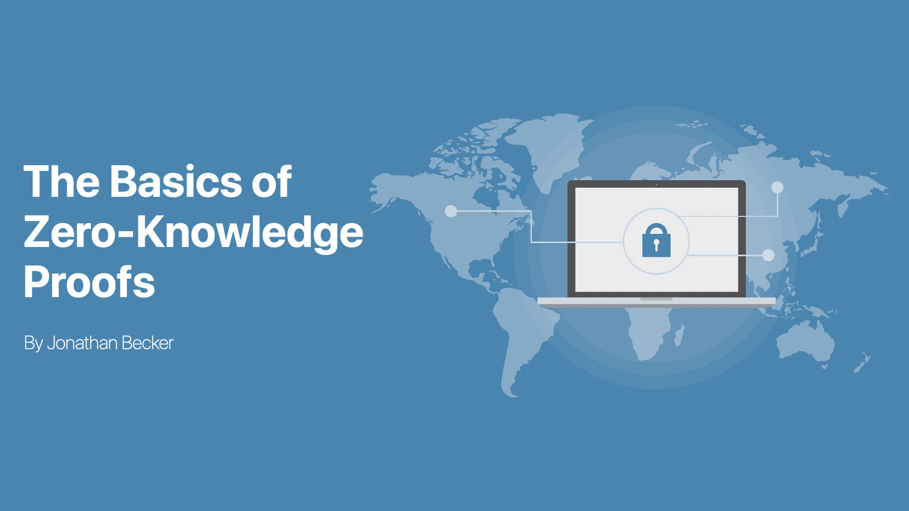

# Understanding Zero-Knowledge: The Basics of ZK Proofs

Zero-knowledge proofs are a fascinating concept in the world of cryptography, allowing for secure verification of information without divulging any details about the information itself. Despite their seemingly impossible nature, these proofs are made possible through intricate mathematical algorithms and cryptographic techniques. In this technical article, we will delve into the basics of ZK proofs, exploring their inner workings and potential applications in various fields such as cryptocurrency and beyond.

## Importance of Zero-Knowledge Proofs
In today's digital age, data privacy and security have never been more important. With the increasing amount of sensitive information being shared online, it is crucial to have secure methods for verifying and authenticating data without compromising its confidentiality. Zero-knowledge proofs allow for this level of security by enabling parties to prove the validity of a statement without revealing any additional information beyond what is necessary. This means that sensitive data can be protected while still allowing for verification and authentication.

For example, zero-knowledge proofs can be used to confirm the legitimacy of a financial transaction without disclosing any confidential details about the parties involved, as demonstrated by [ZCash](https://z.cash/) or EVM protocols such as TornadoCash. Beyond cryptocurrency and finance, zero-knowledge proofs have diverse applications. They can be used in voting systems to ensure accurate vote counting while maintaining voter anonymity. In supply chain management, they can verify product authenticity and origin without revealing sensitive information about the manufacturer or supplier. In healthcare, zero-knowledge proofs could securely share medical records between providers while protecting patient privacy.

Overall, zero-knowledge proofs have vast potential across various industries where data privacy and security are paramount concerns.

## How Zero Knowledge Proofs Work
In a zero knowledge proof, the prover wants to convince the verifier that they know something without revealing what that thing is. The proof works by demonstrating to the verifier that certain conditions are met, which could only be true if the prover actually knows the secret information.

### An Introduction to Zero Knowledge Proofs: A Simple Example
Consider Bob is colorblind and has two objects, one red and one blue, which are otherwise indistinguishable. Alice wants to prove to Bob that she knows the colors of these objects, but doesn't want to tell Bob what the colors are. How can Alice prove to Bob that she can tell the difference between these objects, and how can he be sure she is telling the truth?

In order for Bob to trustlessly verify that Alice can tell the color of the objects without learning the color of them, he can show her the objects, choose to switch them behind his back or not, and ask her if he switched them. If Alice responds correctly, Bob can be sure with a $50\%$ certainty that she knows the color of the balls, which isn't very satisfactory. 

To increase the certainty, Bob can repeat the process multiple times, which can increase his confidence in Alice's ability to distinguish between the objects. With each repetition, the likelihood of Alice being able to accurately lie decreases exponentially with a probability of $(\frac{1}{2})^n$, where $n$ is the number of consecutive rounds with correct responses. After 10 rounds, Bob can conclude with a $90.23\%$ probability that Alice is truthful, and after 20 rounds this probability increases to $99.99\%$.

This example is oversimplified, but it illustrates how zero knowledge proofs can work in practice. In reality, more complex mathematical algorithms are used for creating and verifying these proofs in secure systems such as blockchain networks.

### Getting deeper, 