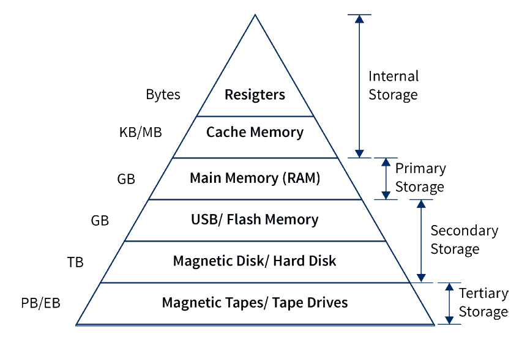

# Maximizing Your Rust Code's Performance


Writing efficient code in Rust requires much more than just following the language's rules. It also involves understanding the underlying hardware architecture, optimizing algorithms and data structures, minimizing memory allocations and copying, leveraging parallelism when possible, and profiling your code to identify bottlenecks. In this article, we'll dive into the world of writing efficient Rust code by explore techniques and best practices that can help dramatically improve the performance of your Rust programs.

This article assumes that you have basic knowledge of Rust, including its syntax, intricacies, and rules. If you're new to Rust, I recommend starting with the [official Rust documentation](https://doc.rust-lang.org/book/) and [tutorials](https://github.com/rust-lang/rustlings) before diving into performance optimization.

## Understanding the Hardware Architecture

In order to start writing efficient Rust code, you should first have a basic understanding of the underlying hardware architecture. This includes things like the CPU, memory hierarchy, and cache. Understanding these concepts can help you make informed decisions about how to structure your code and data to take advantage of the hardware's capabilities.

### The CPU

The CPU is the like computers processing powerhouse. It executes instructions and carries out calculations, making it one of the most important components when it comes to performance. 

The CPU consists of multiple cores, each capable of executing instructions independently. In order to fully utilize the CPU's capabilities, it's important to write code that can take advantage of parallelism.

Let's say we have a large collection of images that need to be resized. If we do so sequentially, it'll take a long time since each iteration has to wait for the previous one to finish. For example, this function handles image resizing sequentially in a `for` loop:

```rust
fn resize_images_sequentially() {
    // Load a collection of images
    let images = vec![
        "image1.png",
        "image2.png",
        "image3.png",
		...
    ];

    for image_path in images {
        // Load the image from disk
        let img = image::open(image_path).expect("Failed to open the image");
            
        // Resize the image
        let resized_img = resize_image(img);
        
        // Save the resized image to disk
        let output_path = format!("resized_{}", image_path);
        resized_img.save(output_path).expect("Failed to save the resized image");
    }
}
```

By leveraging parallelism, we can distribute the resizing task across multiple CPU cores, allowing us to process multiple images simultaneously and significantly reducing the overall processing time. Luckily, Rust's standard library comes packed with [parallelism and concurrency](https://doc.rust-lang.org/book/ch16-00-concurrency.html) features, so we can start multi-threading out of the box:

```rust
fn resize_images_in_parallel() {
    // Load a collection of images
    let images = vec![
        "image1.png",
        "image2.png",
        "image3.png",
        ...
    ];

    let mut handles = vec![];

    for image_path in images {
        // Spawn a new thread for each image processing task
        handles.push(thread::spawn(move || {
            // Load the image from disk
            let img = image::open(image_path).expect("Failed to open the image");
            
            // Resize the image
            let resized_img = resize_image(img);
            
            // Save the resized image to disk
            let output_path = format!("resized_{}", image_path);
            resized_img.save(output_path).expect("Failed to save the resized image");
        }));
    }

    // Wait for all threads to finish
    for handle in handles {
        handle.join().unwrap();
    }
}
```

In this code, we take advantage of being able to use multiple CPU cores by handling the resize task at the same time for all the images. This can significantly speed up your code, and you should try to use it wherever it proves effective. Benchmarking the above functions, we can see that the parallel version is much faster than the sequential one:

```text
benchmark_resize_images_concurrently:
    104.509ms ± 25.90ms per run ( with 100_000 runs ).
  benchmark_resize_images_in_parallel:
    219.319ms ± 71.21ms per run ( with 100_000 runs ).
```

### Memory Hierarchy

The memory hierarchy refers to the different levels of memory in a computer system, ranging from fast but small caches to slower but larger main memory. Accessing data from higher levels of the hierarchy is faster than accessing data from lower levels.



When writing efficient Rust code, it's important to minimize cache misses by optimizing your data structures and algorithms. This involves organizing your data in a way that maximizes spatial locality (accessing nearby memory locations) and temporal locality (reusing recently accessed data).

A simple example of this is using structs to group related data together, which can improve spatial locality. By accessing the fields of a struct together, you are more likely to access nearby memory locations, reducing cache misses. Rather than doing something like:

```rust
let x = 1;
let y = 2;
let z = 3;

// do something with x, y, and z
```

You can group the variables together in a struct:

```rust
struct XYZ {
    x: i32,
    y: i32,
    z: i32,
}

let xyz = XYZ { x: 1, y: 2, z: 3 };

// do something with xyz.x, xyz.y, and xyz.z
```

This way, accessing `xyz.x`, `xyz.y`, and `xyz.z` is more likely to access nearby memory locations. You should only do this where grouping those variables makes sense, however.

Another optimization technique is to use try using arrays instead of linked lists or other dynamic data structures wherever possible. Arrays provide better spatial locality because the elements are stored next to each other in memory, so accessing them is faster than accessing elements scattered throughout memory.

For example, consider a program that needs to iterate over a collection of integers. Instead of using a linked list:

```rust
let mut list = LinkedList::new();
list.push_back(1);
list.push_back(2);
list.push_back(3);

for item in list {
    // do something with item
}
```

You can use an array:

```rust
let array = [1, 2, 3];

for item in &array {
    // do something with item
}
```

By using an array, you are accessing adjacent elements in memory, which improves spatial locality and reduces cache misses.

In addition to optimizing data structures and algorithms, it's also important to be aware of the memory hierarchy when designing your code. For example, if you have a computationally intensive loop that operates on a large dataset, you may want to break up the loop into smaller chunks to improve temporal locality. This allows the CPU to keep more data in its cache for faster access.

Overall, understanding the memory hierarchy and optimizing your code accordingly can lead to significant performance improvements. By paying attention to how you use and access data structures, you can effortlessly improve your code.

### Cache

The CPU cache is a small but extremely fast type of memory that stores frequently accessed data. It acts as a buffer between the CPU and main memory, allowing for faster access to data.

When writing efficient Rust code, it's important to be aware of cache behavior and optimize your code accordingly. This includes minimizing cache misses by organizing your data in a cache-friendly manner and avoiding unnecessary memory allocations and copying.

For example, instead of creating new objects or arrays inside loops, you can reuse existing ones to reduce memory allocations. Additionally, you can use techniques like loop unrolling or vectorization to maximize cache utilization.